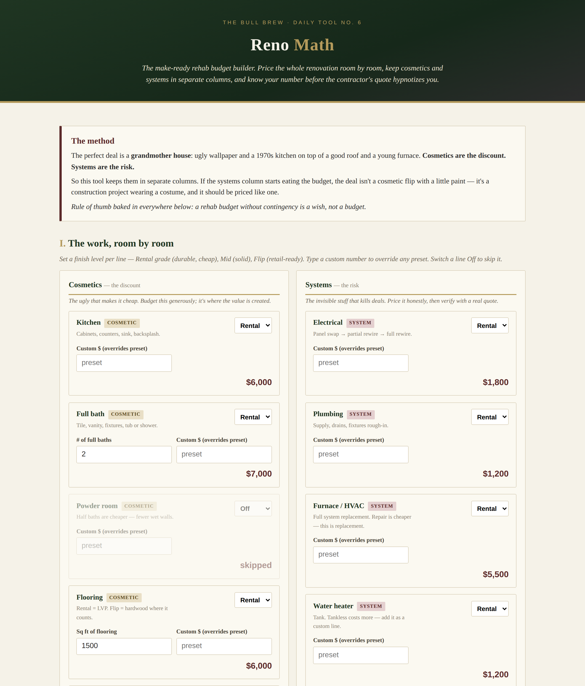

# Reno Math — Make-Ready Rehab Budget Builder

**Live:** https://thebullbrew.github.io/reno-budget-builder/

## What it does

A room-by-room rehab budgeting tool for buy-renovate-rent investors. Pick a finish level per line (Rental / Mid / Flip) with investor-grade presets, add quantities where they matter (baths, flooring sqft, windows), override any line with a custom number, and get a live all-in budget with contingency and GC markup — then run the 70% rule against your purchase price to see if the deal still works.

## The method behind it

The perfect deal is a **grandmother house**: ugly wallpaper and a 1970s kitchen on top of a good roof and a young furnace. **Cosmetics are the discount. Systems are the risk.** So Reno Math keeps them in separate columns — and flags the budget when systems start eating more than 40% of the hard costs. A systems-majority budget isn't a cosmetic flip; it's a construction project wearing a costume, and it should be priced like one.

A rehab budget without contingency is a wish, not a budget — 15% is baked in as the default, with 20%+ suggested for 1970s surprises.

## How to run

No backend, no build step. Open `docs/index.html` in any browser, or serve the `docs/` folder from any static host. Installable as a PWA (offline-capable). All saved budgets live in your browser's localStorage — nothing leaves your machine.
